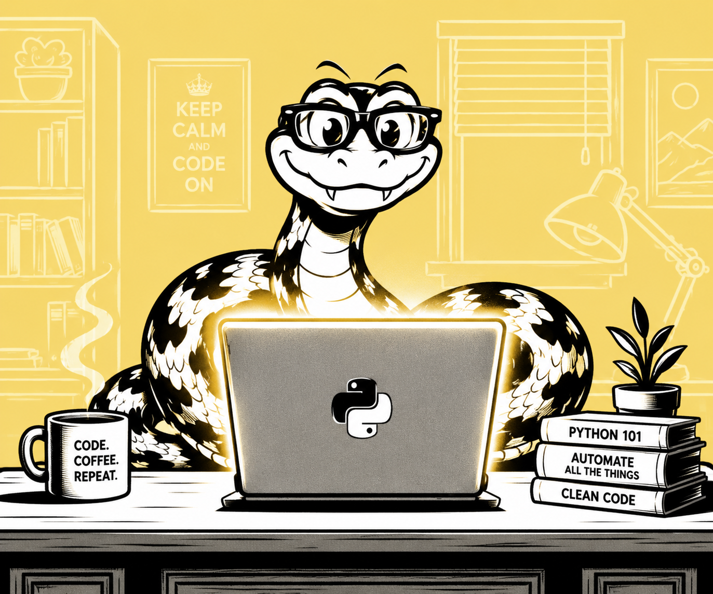

# Python: A Crash Course — A Beginner's Journey

> An interactive, self-contained desktop learning app for anyone who wants to learn Python in a fun, practical, and hands-on way.



---

## 📖 About

**Python: A Beginner's Journey** is a locally-run web app that turns learning Python into an interactive experience. It includes structured lessons, a live Python sandbox, quizzes with XP rewards, a day streak tracker, and an AI-powered tutor — all running on your own machine with no internet required for the core features.

This project was inspired by two fantastic books by **Eric Matthes**:
- *Python Crash Course* (No Starch Press)
- *The Big Book of Small Python Projects* (No Starch Press)

All lesson content, explanations, and code examples in this app are original. We gratefully acknowledge Eric Matthes for inspiring this learning journey.

---

## ✨ Features

- 📖 **11 interactive chapters** covering Python fundamentals — from Hello World through to Testing
- 🖥️ **Live Python sandbox** with syntax highlighting — runs real Python on your machine
- 🧠 **Quizzes with XP rewards** — earn points and unlock new chapters
- 🔥 **Day streak tracker** — keeps you motivated to learn every day
- 🤖 **AI tutor** powered by Claude (Anthropic API) — ask anything, get clear analogies
- 📝 **Video script generator** — create original YouTube scripts for each chapter
- ⧉ **Floating pop-out lesson panel** — drag it anywhere while you code
- 📊 **Progress dashboard** — track XP, completed chapters, and quiz scores
- 🎬 **YouTube video slots** — ready to embed your own lesson videos
- ☰ **Collapsible sidebar** — more screen space when you need it
- 💾 **Persistent progress** — saves locally between sessions
- 📴 **Fully offline core** — code editor and Python runner libraries are bundled, no CDN needed

---

## 🚀 Getting Started

### Requirements

- **Python 3.8 or higher** — download free at [python.org](https://www.python.org/downloads/)
- Flask (installed automatically on first run)

### Installation

1. Download the latest release zip from the [Releases](../../releases) page
2. Extract the zip to a folder of your choice
3. Launch the app:

**Ubuntu / Linux / macOS:**
```bash
cd pcc_app
chmod +x START_MAC_LINUX.sh
./START_MAC_LINUX.sh
```

**Windows:**
```
Double-click START_WINDOWS.bat
```

4. Your browser opens automatically at `http://127.0.0.1:5757`
5. A desktop shortcut and app launcher entry are created automatically on first run (Linux)

---

## 🤖 AI Tutor Setup (Optional)

The AI Tutor and Script Generator require a free Anthropic API key:

1. Sign up at [console.anthropic.com](https://console.anthropic.com)
2. Create an API key
3. Inside the app, click **Settings** in the sidebar and paste your key

Your key is stored locally on your machine and never shared.

---

## 📚 Chapters Included

| # | Chapter | Topics |
|---|---------|--------|
| 1 | Hello World | Setup, print(), the interpreter |
| 2 | Variables | Strings, numbers, data types |
| 3 | Lists | Collections, indexes, methods |
| 4 | Loops | for loops, range(), list comprehensions |
| 5 | if Statements | Conditions, elif, else, comparisons |
| 6 | Dictionaries | Key-value pairs, looping, nesting |
| 7 | While Loops | while, break, continue |
| 8 | Functions | def, return, *args, default values |
| 9 | Classes | OOP, __init__, inheritance |
| 10 | Files & Exceptions | Reading/writing files, try/except |
| 11 | Testing | assert, unittest, test-driven thinking |

---

## 📁 Project Structure

```
pcc_app/
├── app.py                  ← Flask server (routes, API, code runner)
├── index.html              ← Full app UI (lessons, sandbox, quiz, tutor)
├── appIcon.png             ← App icon
├── START_MAC_LINUX.sh      ← Launcher for Ubuntu/macOS
├── START_WINDOWS.bat       ← Launcher for Windows
├── progress.json           ← Your saved progress (auto-created, not tracked)
└── .venv/                  ← Virtual environment (auto-created, not tracked)
```

---

## 🛠️ Tech Stack

| Layer | Technology |
|-------|-----------|
| Server | Python 3 + Flask |
| UI | HTML, CSS, Vanilla JavaScript |
| Code editor | CodeMirror 5 (Dracula theme) |
| Python runner | Flask subprocess (real Python execution) |
| AI Tutor | Anthropic Claude API (claude-sonnet-4-6) |
| Progress storage | JSON file (local) |
| Desktop launcher | .desktop file (Linux), .bat (Windows) |

---

## 🗺️ Roadmap

- [ ] YouTube video embeds per chapter (in progress — videos being created)
- [ ] Projects tab inspired by *The Big Book of Small Python Projects*
- [ ] Chapters 12+ (Pygame, data visualization, web apps)
- [ ] Dark/light theme toggle
- [ ] Mobile-friendly layout

---

## 📋 Changelog

See [CHANGELOG.md](CHANGELOG.md) for full version history.

---

## 📄 License

This project is licensed under the MIT License — see [LICENSE](LICENSE) for details.

---

## 🙏 Credits & Inspiration

- **Eric Matthes** — *Python Crash Course* and *The Big Book of Small Python Projects* (No Starch Press)
- **Anthropic** — Claude AI powering the tutor and script generator
- **CodeMirror** — syntax highlighting in the sandbox
- **Flask** — the lightweight server that makes it all run locally

---

## 👤 Author

**Allen** — built this to make Python actually stick while working through the book.  
If it helps you too, give it a ⭐ and share it!
